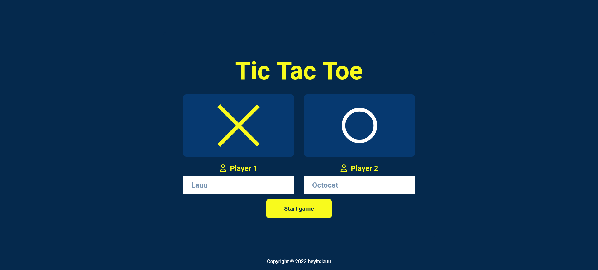
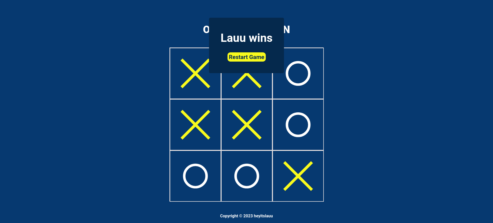

# Project: Tic Tac Toe

* [Link](https://www.theodinproject.com/lessons/node-path-javascript-tic-tac-toe) of the Project Description

## Introduction
* We’re making a Tic Tac Toe game you can play in your browser!
* Lesson covering javascript factory functions and module pattern

Click **[here](https://heyitslauu.github.io/odin-javascript/projects/tic-tac-toe/index.html)** to show the project 

## Results

#### Game Init

#### Actual Game

## Key Take aways
1.  Factory Functions
2. Module Pattern
3. 'Privacy' with the help of closures 
